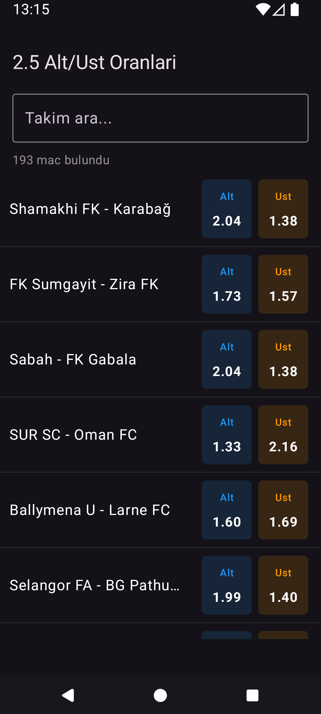
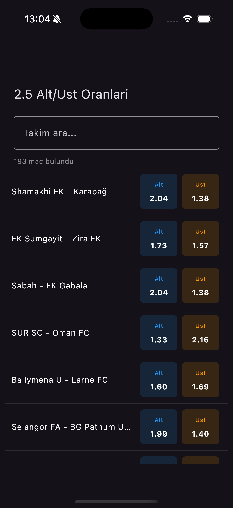
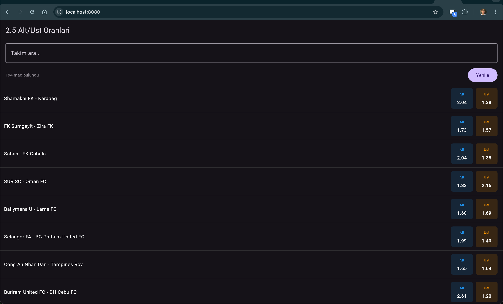

# 2.5 Alt/Ust

A Kotlin Multiplatform application that displays 2.5 Over/Under betting odds for football matches from iddaa.com.

## Screenshots

| Android | iOS | Web |
|---------|-----|-----|
|  |  |  |

## Features

- View 2.5 Over/Under odds for football matches
- Search matches by team name
- Pull-to-refresh on mobile platforms
- Dark theme UI
- Cross-platform support (Android, iOS, Web)

## Tech Stack

- **[Kotlin Multiplatform](https://kotlinlang.org/docs/multiplatform.html)** - Share code across platforms
- **[Compose Multiplatform](https://www.jetbrains.com/lp/compose-multiplatform/)** - Declarative UI framework
- **[Ktor Client](https://ktor.io/docs/client-overview.html)** - HTTP networking
- **[Kotlinx Serialization](https://github.com/Kotlin/kotlinx.serialization)** - JSON parsing
- **[Koin](https://insert-koin.io/)** - Dependency injection
- **[Kotlin Coroutines](https://kotlinlang.org/docs/coroutines-overview.html)** - Asynchronous programming

## Project Structure

```
composeApp/
├── commonMain/          # Shared code for all platforms
│   ├── data/            # Repository, models, exceptions
│   ├── di/              # Koin modules
│   └── ui/              # ViewModel and Composables
├── androidMain/         # Android-specific code
├── iosMain/             # iOS-specific code
├── jsMain/              # JS-specific code
└── wasmJsMain/          # WASM-specific code
```

## Build & Run

### Android
```shell
./gradlew :composeApp:assembleDebug
```

### iOS
Open `/iosApp` in Xcode and run.

### Web (WASM)
```shell
./gradlew :composeApp:wasmJsBrowserDevelopmentRun
```

### Web (JS)
```shell
./gradlew :composeApp:jsBrowserDevelopmentRun
```
